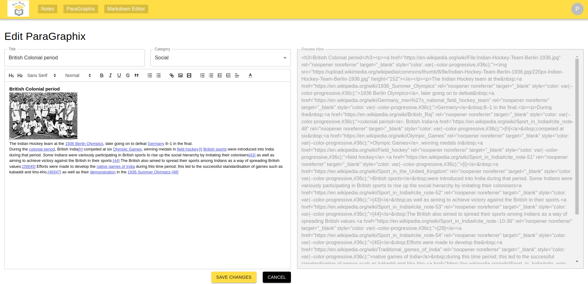
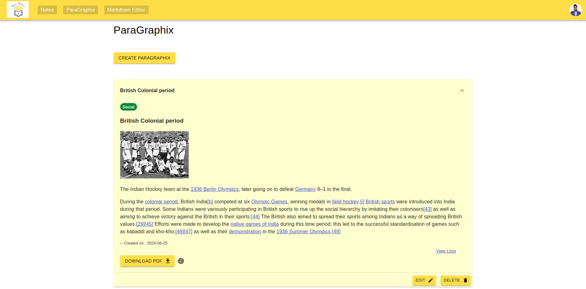
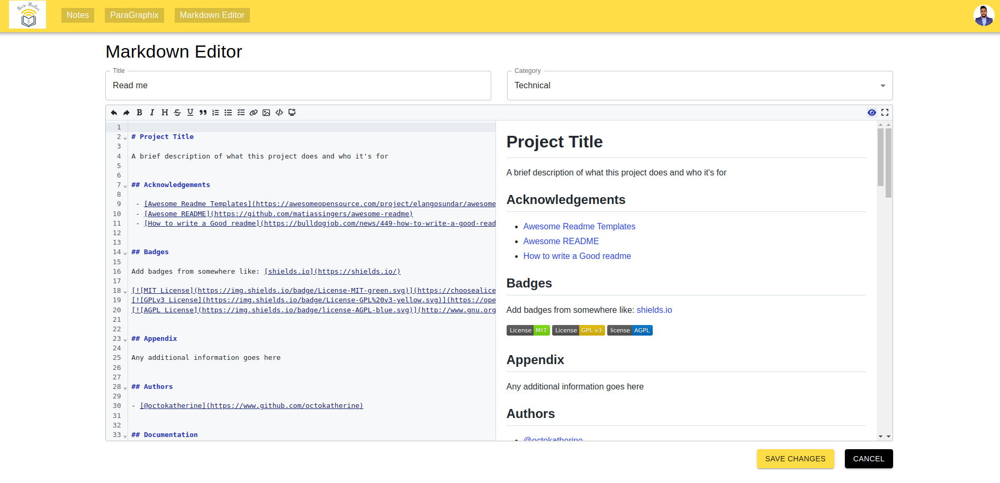
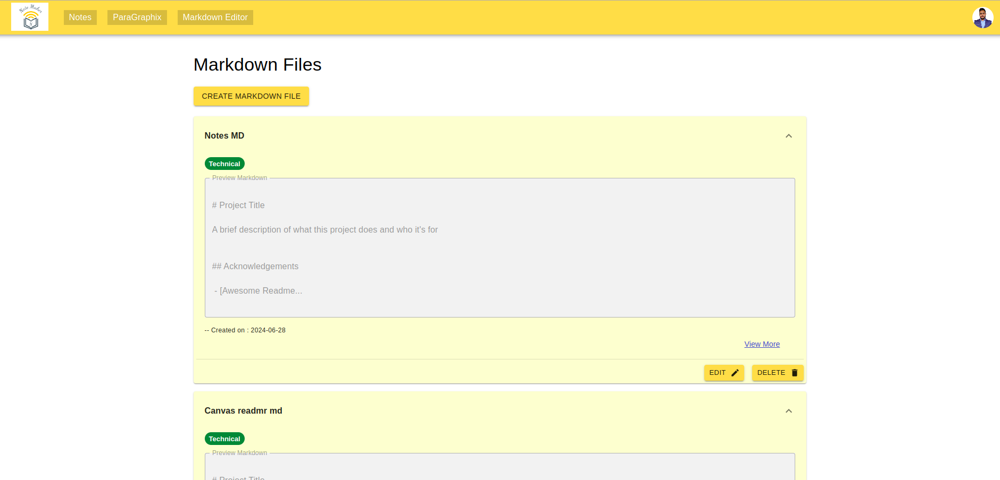

# NoteMaster Pro

NoteMaster Pro is your ultimate productivity companion, designed to streamline your note-taking and content creation process. This versatile web app offers a range of powerful features to enhance your workflow:

- CRUD Operations: Fully functional Create, Read, Update, and Delete operations ensure seamless management of all your content, giving you complete control over your data.

- Note Maker: Easily create and organize your notes with a user-friendly interface. Upload files of all formats, including images, PDFs, and videos, to keep everything you need in one place.

    

- Text Editor: Enjoy a robust text editor that supports rich text formatting, image insertion, and PDF download capabilities, making document creation and sharing effortless.

    

    

- Markdown Editor: Leverage the full power of markdown with a live preview feature. Edit, preview, and download your markdown files with ease, ensuring your documents are always in top form.

    

    

NoteMaster Pro is designed for efficiency, flexibility, and ease of use, making it the perfect tool for students, professionals, and anyone looking to enhance their note-taking and content creation experience.